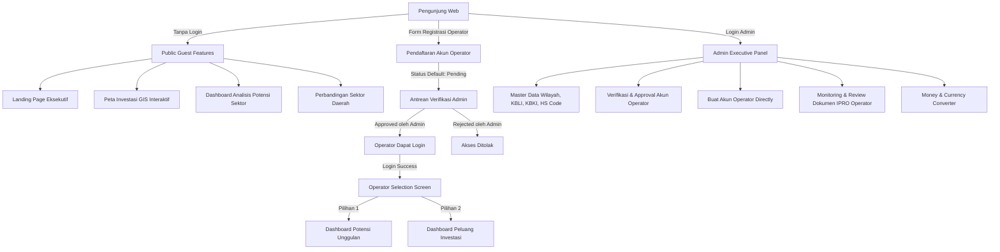
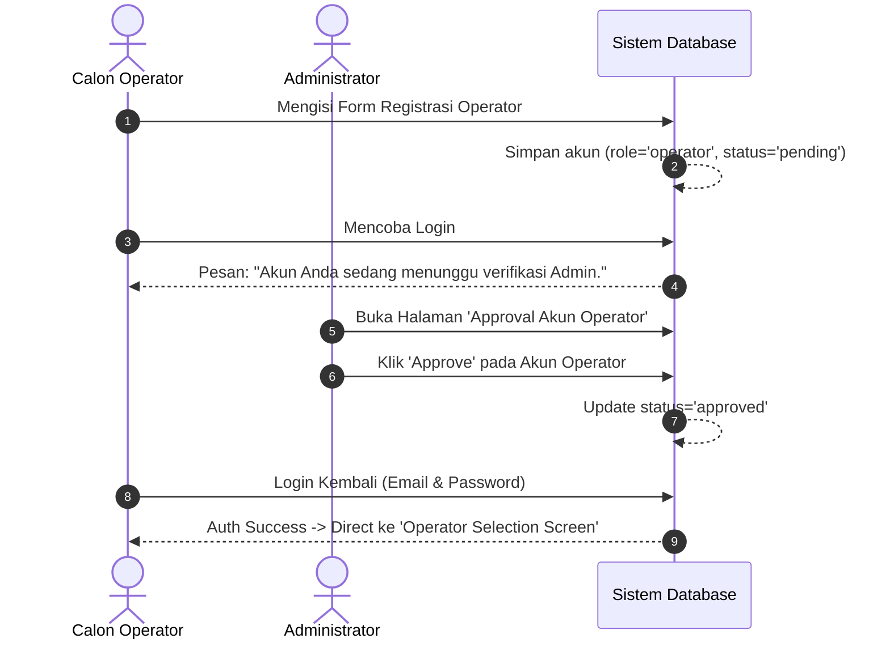

# Product Requirement Document (PRD) - Integrated Final
## Executive Dashboard for Sumatera Investment & Investment Opportunity Calculation Engine (Web DPMPTSP)

**Versi Dokumen:** 2.0 (Final Integrated Specification)  
**Tanggal:** 27 Juli 2026  
**Status:** Active Development / Integrated Architecture  
**DBMS Target:** PostgreSQL 15+  
**Target Pengguna:** Investor & Pengunjung Umum (Guest), Operator Analisis Data Ekonomi & Finansial, Administrator Sistem.

---

## 1. Ikhtisar & Tujuan Produk (Product Overview)

**Dashboard Executive for Sumatera Investment (Web DPMPTSP)** adalah platform web terpadu yang menggabungkan dua pilar utama pelayanan investasi daerah:

1. **Potensi Unggulan Daerah (Macroeconomic Analysis)**: Analisis makroekonomi kuantitatif daerah berbasis data PDRB menggunakan 4 metode (*Location Quotient*, *Shift-Share*, *Tipologi Sektor*, dan *Tipologi Klassen*) serta visualisasi Peta GIS Interaktif.
2. **Peluang Investasi Daerah (Micro Financial Project Calculation / IPRO Engine)**: Digitalisasi penyusunan dokumen kelayakan finansial proyek investasi *Ready to Offer* meliputi komputasi hirarki CAPEX, Proyeksi Laba Rugi (P&L), dan Arus Kas (*Dynamic Real-Time Cash Flow*).

---

## 2. Spesifikasi Technology Stack (Tech Stack & Architecture)

Untuk pembuatan dan pengembangan proyek terintegrasi yang baru, berikut adalah spesifikasi *Tech Stack* dan dependensi teknologi yang diperlukan:

### 2.1 Backend & Server Architecture
* **Bahasa Pemrograman**: PHP 8.2+
* **Framework Backend**: Laravel 12.x
* **Authentication & Security**:
  * Laravel Breeze (Session Authentication, Password Hashing, Email Verification).
  * Custom Role-Based Access Control (RBAC) Middleware (`role:admin`, `role:operator`, `role:user`).
  * Middleware Verifikasi Status Operator (`status: approved`).
  * Two-Factor Authentication (2FA) support untuk Admin/Operator.
* **Arsitektur Kode**: Model-View-Controller (MVC) dipadu dengan **Service-Oriented Architecture** (`App\Services\*`) untuk komputasi terpisah pada kalkulasi makro & mikro finansial.

### 2.2 Database System & Data Persistence
* **DBMS Engine**: **PostgreSQL 15+** (Driver `pgsql` via PDO).
* **ORM & Database Tooling**: Eloquent ORM + Database Migrations & Seeders.
* **Standar Presisi Uang**: `NUMERIC(20, 2)` / `DECIMAL(20, 2)` (Mencegah galat pembulatan nilai mata uang).
* **Standar Waktu**: `TIMESTAMPTZ` (`TIMESTAMP WITH TIME ZONE`).

### 2.3 Frontend & UI/UX Framework
* **Engine Template**: Laravel Blade Templating Engine.
* **Styling**: Tailwind CSS v3 / v4 + PostCSS (`@tailwindcss/vite`).
* **Interaktivitas Client-Side**: Alpine.js & Vanilla JavaScript (Digunakan untuk kalkulasi interaktif *real-time* tabel CAPEX & P&L di browser).
* **Typography**: Google Fonts (`Poppins` 300-800, `Inter`, `Figtree`).

### 2.4 Data Visualization & GIS Libraries
* **Geospatial / GIS Map**: Leaflet.js v1.9.4 + OpenStreetMap API (Visualisasi titik lokasi investasi & popup indikator daerah).
* **Grafik & Data Visualization**: Chart.js v4.5.1 (Grafik batang, garis, & statistik komparasi investasi).
* **UI Select & Controls**: React Select v5.10.2 / Custom Alpine Select Pickers.

### 2.5 Dev Tooling, Build System & Plugins
* **Build System**: Vite v7.0 dengan `laravel-vite-plugin`.
* **Process Manager**: Concurrently (`npm run dev` menjalankan `php artisan serve`, `queue:listen`, `pail`, & `vite`).
* **Processing Data Massal**: PhpSpreadsheet / `laravel-excel` (Handling impor/ekspor data PDRB & LQ via `.xlsx`).
* **Code Formatter & Testing**: Laravel Pint, Pest PHP v3.8 / PHPUnit.

---

## 3. Peran Pengguna & Hak Akses (3-Tier User Roles & Access Control)

Sistem menggunakan **3 Tingkat Peran Pengguna (Roles)** dengan alur autentikasi dan otorisasi terpusat:



### 3.1 Perincian Hak Akses Peran

1. **Guest / Publik (Tanpa Login)**:
   * Mengakses seluruh fitur publik secara penuh tanpa perlu mendaftar atau membuat akun (*Zero-Login Requirement*).
   * Fitur terbatas murni pada pembacaan (*read-only*) dari `PRD.md`: Landing Page, Peta GIS Investasi, Dashboard Analisis Potensi Sektor, dan Perbandingan Sektor.
   * Diberikan opsi akses ke Form Registrasi apabila ingin mendaftar sebagai calon Operator.

2. **Operator (Melalui Registrasi & Approval Admin)**:
   * **Alur Pendaftaran**: Mendaftar mandiri via form register. Status akun otomatis `pending`. Akun tidak dapat login hingga disetujui Admin.
   * **Alur Login**: Setelah disetujui (`approved`), Operator dapat masuk dari halaman login.
   * **Selection Screen (Halaman Pemilihan Work Area)**: Sesaat setelah login, Operator diarahkan ke halaman khusus untuk memilih 2 area kerja:
     * 🟢 **Option A: Potensi Unggulan**: Kelola data PDRB, jalankan 4 analisis ekonomi (LQ, Shift-Share, Tipologi Sektor, Tipologi Klassen), Impor Excel, dan Sinkronisasi Data.
     * 🔵 **Option B: Peluang Investasi**: Buat & kelola dokumen finansial proyek IPRO (Estimasi CAPEX berjenjang, Proyeksi Laba Rugi P&L, Pengaturan Pembiayaan Kredit & Arus Kas Otomatis).

3. **Admin (Administrator Sistem & Verifikator)**:
   * Login penuh ke sistem Admin Dashboard.
   * **Fungsi Utama**:
     * **Verifikasi Akun Operator**: Meninjau pendaftaran calon Operator (Aksi: `Approve` / `Reject`).
     * **Pembuatan Akun Operator**: Membuat akun Operator secara langsung tanpa melalui antrean pending.
     * **Monitoring Dokumen Proyek IPRO**: Meninjau dan melihat seluruh rincian input data dokumen proyek IPRO (CAPEX, P&L, & Arus Kas) yang telah diinput dan disimpan (*saved*) oleh seluruh Operator secara sistemik.
     * **Master Data Management**: Pengelolaan hirarki Wilayah (Provinsi $\rightarrow$ Desa), KBLI, KBKI, HS Code, & Lokasi GIS.
     * **Tools Keuangan & Keamanan**: Converter Mata Uang, Pengaturan Keamanan 2FA, & Audit Activity Log.

---

## 4. Alur Kerja Sistem & Pengalaman Pengguna (Workflow & User Experience)

### 4.1 Alur Registrasi & Approval Operator



### 4.2 Alur Operator Dashboard Selection Screen

Setelah Operator berhasil melakukan autentikasi, sistem menampilkan **Dashboard Choice Screen**:

```
+-----------------------------------------------------------------------+
|                 SELAMAT DATANG, OPERATOR DATA DPMPTSP                 |
|       Silakan pilih modul kerja yang ingin Anda kelola hari ini:     |
+-----------------------------------------------------------------------+
|                                  |                                    |
|   📊 POTENSI UNGGULAN DAERAH     |   💼 PELUANG INVESTASI (IPRO)      |
|   ----------------------------   |   ----------------------------     |
|   • Analisis PDRB Makroekonomi   |   • Rincian Estimasi CAPEX         |
|   • Location Quotient (LQ)       |   • Proyeksi Laba Rugi (P&L)       |
|   • Shift-Share Analysis (SSA)   |   • Auto Dynamic Cash Flow         |
|   • Tipologi Sektor & Klassen    |   • Parameter Debt/Equity Ratio    |
|                                  |                                    |
|   [ Masuk Modul Potensi ]        |   [ Masuk Modul Peluang ]          |
+-----------------------------------------------------------------------+
```

---

## 5. Sistem Desain & Palet Warna (Brand Color Palette DPMPTSP)

Sistem mengadopsi palet warna resmi **DPMPTSP Modern Government Portal & Investment Platform** berbasis *Forest Green*, *Amber Gold*, dan *Soft Mint*:

| Kategori UI | Kode HEX | Penggunaan & Karakter Utama |
| :--- | :--- | :--- |
| **Brand Primary** | `#145239` *(Forest Green)* | Hijau Utama (Header Text, Primary Buttons, Hero Titles, Footer Hover) |
| **Brand Dark** | `#0B5D3D` *(Deep Emerald)* | Hijau Tua (Background utama Footer & aksen penegas bawah) |
| **Brand Medium** | `#1E5D41` *(Medium Emerald)* | Subtitle section, hover state tombol operator, teks penjelas |
| **Accent Gold** | `#FFD54F` *(Sunflower Gold)* | Kuning Emas (Tombol Login/CTA Navbar, Highlight Hero) |
| **Accent Active** | `#D4A017` *(Mustard Gold)* | Indikator menu aktif (Active Nav Link & underline animasi) |
| **Accent Bright** | `#FFC93B` *(Bright Yellow)* | Teks badge interaktif & hover aksen terang |
| **Surface Capsule** | `#E7F2EB` *(Soft Mint Green)* | Background capsule floating menu navigasi desktop |
| **Surface Badge** | `#EEF8F2` *(Light Sage Green)* | Tagline badge hero & background container input form |
| **Background Page** | `#F7FAF8` *(Canvas Off-White)* | Background utama body halaman web |
| **Surface Card** | `#FFFFFF` *(Pure White)* | Background card kontainer, modal dialog, & sticky header |
| **Text Main** | `#17201C` *(Dark Soft Slate)* | Judul artikel, paragraf utama, & label form |
| **Text Muted** | `#667069` *(Greenish Grey)* | Sub-judul, tanggal, keterangan kecil, & placeholder |
| **Border Light** | `#CFE3D5` *(Soft Mint Border)* | Garis tepi kartu, border input form, & pemisah tabel |
| **Secondary Navy** | `#001E6C` *(Navy Deep Blue)* | Variasi judul section peta & kontras khusus |
| **Secondary Blue** | `#5089C6` *(Royal Blue)* | Elemen grafik Chart.js & statistik visual komparasi |

---

## 6. Matriks Fitur Lengkap Sesuai Hak Akses

### 6.1 Fitur Guest / Publik (Tanpa Login)
* **Landing Page Eksekutif (`/`)**: Counter statistik daerah, ringkasan metode analisis, & hero banner.
* **Peta Investasi GIS Interaktif (`/peta-investasi`)**: Visualisasi Leaflet.js penanda lokasi daerah & popup potensi ekonomi.
* **Dashboard Analisis Sektor (`/analisis`)**: Filter per Kabupaten/Kota, Metode (LQ, SS, Tipologi, Klassen), & Tahun.
* **Perbandingan Sektor (`/perbandingan-sektor`)**: Komparasi grafik laju pertumbuhan & kontribusi antar sektor.
* **Halaman Informasi (`/about`)**: Profil singkat & FAQ DPMPTSP.

### 6.2 Fitur Operator
* **Selection Screen (`/operator/dashboard`)**: Halaman transisi pemilihan modul kerja.
* **Modul Potensi Unggulan (`/operator/potensi-unggulan`)**:
  * Management & Komputasi LQ ($LQ > 1$).
  * Shift-Share Analysis ($N, P, D$).
  * Matrix Tipologi Sektor (Kuadran I-IV) & Sinkronisasi DB.
  * Tipologi Klassen ($r$ vs $y$).
  * Import Massal via Excel (`.xlsx`) & Bulk Delete.
* **Modul Peluang Investasi (`/operator/peluang-investasi`)**:
  * Form Pembuatan Proyek IPRO (Nama, Kabupaten, Sektor, Lokasi GIS).
  * Tabel CAPEX Hierarkis Dinamis (Rumus adaptif $\text{Vol} \times \text{Luas} \times \text{Harga}$ & auto roll-up).
  * Tabel Proyeksi Laba Rugi P&L (Base Year, PPh, Pajak Daerah, BOT Fee, Bunga, Depresiasi).
  * Auto Cash Flow Engine (60% Equity : 40% Debt, Suku Bunga 8.05%, Tenor N Tahun).

### 6.3 Fitur Administrator (Admin)
* **Executive Overview (`/admin/dashboard`)**: Overview aktivitas user & statistik data.
* **Approval Akun Operator (`/admin/operator-approval`)**: Tabel daftar registrasi calon Operator berstatus `pending` dengan tombol aksi `Approve` atau `Reject`.
* **Buat Akun Operator Direct (`/admin/pengguna/create`)**: Form pendaftaran langsung Operator oleh Admin tanpa melalui pending.
* **Monitoring Dokumen Proyek IPRO (`/admin/proyek-ipro`)**: Halaman viewer & peninjauan seluruh data proyek IPRO (CAPEX, P&L, Arus Kas) yang diinput dan disimpan oleh Operator.
* **Management Master Data**: Pengelolaan hirarki Wilayah (Provinsi $\rightarrow$ Desa dengan Koordinat GIS), KBLI, KBKI, & HS Code.
* **Money Currency Converter (`/admin/money-currency`)**: Kalkulator nilai tukar mata uang investasi.
* **Pengaturan Keamanan**: Profil Admin, ubah sandi, & konfigurasi 2FA.

---

## 7. Spesifikasi Database Terintegrasi (PostgreSQL)

Database menggunakan DBMS **PostgreSQL 15+** dengan tabel terintegrasi yang terbagi ke dalam 5 Domain Utama:

```
📂 DATABASE SCHEMA (PostgreSQL)
├── 👥 Domain 1: Security & Users (users, activity_logs, import_histories)
├── 🗺️ Domain 2: Regional & GIS (provinsi, kabupaten, kecamatan, kelurahan_desa)
├── 📋 Domain 3: Master Standards (sektor, data_kbli, data_kbki, data_hs_code)
├── 📊 Domain 4: Macro Indicators (pdb_nasional, pdrb_sumatera_provinsi, pdrb_sumatera_kabupaten, indikator_provinsi, indikator_kabupaten)
├── 📈 Domain 5: Macro Analysis Outputs (analisis_lq, analisis_ss, analisis_tipologi, analisis_klassen, analysis_results)
└── 💼 Domain 6: Micro Financial Projects (projects, capex_components, pl_components, pl_yearly_data)
```

Detail spesifikasi teknis DDL PostgreSQL lengkap tersedia pada file [database_schema_integration.md](file:///c:/code/DPMPTSP/app-desi/database_schema_integration.md).

---

## 8. Persyaratan Non-Fungsional (Non-Functional Requirements)

1. **Zero-Login Public Access**: Akses fitur publik tidak memerlukan pengisian kredensial maupun pendaftaran akun.
2. **Presisi Finansial**: Perhitungan angka uang pada modul IPRO menggunakan presisi `NUMERIC(20, 2)` pada PostgreSQL tanpa galat pembulatan float.
3. **Respon Client-Side Interaktif**: Perhitungan kalkulasi CAPEX dan P&L pada dashboard Operator berjalan *real-time* di tingkat browser menggunakan Alpine.js sebelum disimpan ke server.
4. **Auditability**: Setiap aksi persetujuan akun operator (`approve`/`reject`) dan manipulasi data dicatat secara transparan pada tabel `activity_logs`.
