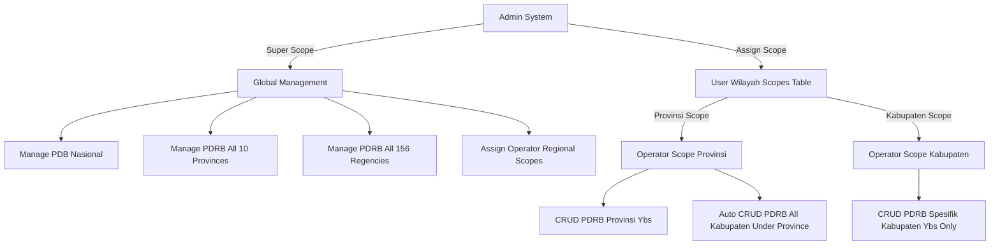

# Product Requirement Document (PRD) - Integrated Final
## Executive Dashboard for Sumatera Investment & Investment Opportunity Calculation Engine (Web DPMPTSP)

**Versi Dokumen:** 3.1 (Hierarchical Regional Scoped Authorization & PDRB Engine)  
**Tanggal:** 1 Agustus 2026  
**Status:** Active Development / Scoped Multi-Tenant Architecture  
**DBMS Target:** PostgreSQL 15+  
**Target Pengguna:** Investor & Pengunjung Umum (Guest), Operator Data Wilayah/Provinsi/Kabupaten, Administrator Sistem.

---

## 1. Ikhtisar & Tujuan Produk (Product Overview)

**Dashboard Executive for Sumatera Investment (Web DPMPTSP)** adalah platform web terpadu dengan sistem otorisasi **Hierarchical Regional Scoped Authorization**:

1. **Pengelolaan Data PDRB Terkoordinasi (PDRB CRUD & Regional Scopes)**:
   - **Admin (Global Access)**: Memiliki hak akses penuh untuk mengelola PDB Nasional, PDRB seluruh 10 Provinsi Sumatera, dan PDRB seluruh 156 Kabupaten/Kota. Admin bertindak sebagai pengalokasi wilayah kerja Operator.
   - **Operator Terlingkup (Regional Scoped Operator)**:
     - **Scope Provinsi**: Jika Operator ditugaskan pada Provinsi tertentu (misal: Sumatera Utara), Operator secara otomatis memiliki hak akses CRUD PDRB untuk **Provinsi tersebut DAN SELURUH Kabupaten/Kota di bawahnya**.
     - **Scope Kabupaten**: Jika Operator ditugaskan pada Kabupaten/Kota tertentu (misal: Kota Medan), Operator hanya dapat mengelola data PDRB Kabupaten/Kota tersebut.
   - **Pencegahan Duplikasi & Out-of-Sync**: Sistem mencegah konflik antar-operator melalui middleware & policy otorisasi wilayah (`user_wilayah_scopes`).

2. **Kalkulasi Makroekonomi Dinamis (Dynamic Real-Time Calculation)**:
   - Seluruh 4 metode analisis makroekonomi (*Location Quotient*, *Shift-Share*, *Tipologi Sektor*, dan *Tipologi Klassen*) dihitung secara **on-the-fly di Service Layer** berbasis data PDRB terkini.

3. **Peluang Investasi Daerah (IPRO Project Calculation Engine)**:
   - Digitalisasi penyusunan dokumen kelayakan finansial proyek IPRO (CAPEX, P&L, & Auto Dynamic Cash Flow).

---

## 2. Matriks Peran Pengguna & Hak Akses Wilayah (Regional Authorization Matrix)



### 2.1 Aturan Otorisasi Hirarki Wilayah
| Peran Pengguna | Tingkat Akses | Hak Akses PDB Nasional | Hak Akses PDRB Provinsi | Hak Akses PDRB Kabupaten |
| :--- | :--- | :--- | :--- | :--- |
| **Admin** | **Global (Full)** | ✅ Semua Tahun | ✅ Semua 10 Provinsi | ✅ Semua 156 Kabupaten/Kota |
| **Operator (Scope Provinsi)** | **Provinsi + Sub-Kabupaten** | ❌ Read Only | ✅ Provinsi Yang Dialokasikan | ✅ **Otomatis Semua Kabupaten** di Bawah Provinsi Tersebut |
| **Operator (Scope Kabupaten)** | **Kabupaten Spesifik** | ❌ Read Only | ❌ Read Only (Visualisasi) | ✅ **Hanya Kabupaten Spesifik** Yang Dialokasikan |
| **Guest / Publik** | **Read-Only** | ❌ Read Only (Visualisasi) | ❌ Read Only (Visualisasi) | ❌ Read Only (Visualisasi) |

---

## 3. Spesifikasi Database Terintegrasi (PostgreSQL Clean Engine v3.1)

Database menggunakan DBMS **PostgreSQL 15+** dengan 20 tabel terintegrasi yang terbagi ke dalam 6 Domain Utama:

```
📂 DATABASE SCHEMA (PostgreSQL)
├── 👥 Domain 1: Security, Users & Regional Scopes (users, user_wilayah_scopes, activity_logs, import_histories)
├── 🗺️ Domain 2: Regional & GIS (provinsi, kabupaten, kecamatan, kelurahan_desa)
├── 📋 Domain 3: Master Standards (sektor, data_kbli, data_kbki, data_hs_code)
├── 📊 Domain 4: Macro Data PDRB (pdb_nasional, pdrb_sumatera_provinsi, pdrb_sumatera_kabupaten)
├── 📈 Domain 5: Operator Custom Simulations (analysis_results)
└── 💼 Domain 6: Micro Financial Projects (projects, capex_components, pl_components, pl_yearly_data)
```

Detail spesifikasi teknis DDL PostgreSQL lengkap tersedia pada file [database_schema_integration.md](file:///c:/code/DPMPTSP/app-desi/database_schema_integration.md).
