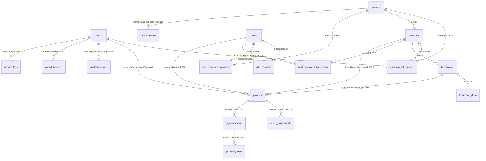

# Spesifikasi & Struktur Database Terintegrasi (PostgreSQL)
## Dashboard Executive Investment DPMPTSP + IPRO Project Calculation Engine

**Versi Database:** 3.3 (Pre-Calculated Materialized Analysis Engine, Regional Scoped Authorization & Data Investasi Daerah)  
**Database Engine:** PostgreSQL 15+  
**Standar Presisi Uang:** `NUMERIC(20, 2)`  
**Standar Waktu:** `TIMESTAMPTZ` (`TIMESTAMP WITH TIME ZONE`)  

---

## 1. Arsitektur Relasi Antar Domain Database

Database dirancang dengan prinsip **Single Source of Truth**, **Pre-Calculated Materialized Analysis Summaries**, dan **Hierarchical Regional Authorization**:
- Seluruh analisis makroekonomi (LQ, Klassen, Shift-Share, Tipologi Sektor) disimpan dalam **Tabel Rekapitulasi Hasil Analisis** (`summary_lq_results`, `summary_klassen_results`, `summary_shift_share_results`, `summary_tipologi_sektor_results`) untuk memastikan query ultra-cepat dan responsif.
- Perubahan pada data PDRB Provinsi/Kabupaten atau PDB Nasional memicu **Event-Driven Auto Sync Engine** yang memperbarui tabel rekapitulasi secara terotomatisasi.
- Pengelolaan data PDRB oleh Operator dibatasi oleh **Scope Wilayah Terdaftar** (`user_wilayah_scopes`).
- Hak akses tingkat **Provinsi** secara **otomatis mencakup seluruh Kabupaten/Kota di bawahnya**.
- **Admin** memiliki hak akses global penuh (Nasional, Seluruh Provinsi, dan Seluruh Kabupaten).

Database terdiri dari **6 Domain Utama**:



---

## 2. Struktur Tabel Detail (PostgreSQL DDL Specification)

### DOMAIN 1: Autentikasi, Keamanan, Pengguna & Otorisasi Wilayah

#### 1. Tabel `users`
Menampung data seluruh pengguna (Admin, Operator, dan User Terdaftar) beserta status verifikasi.

```sql
CREATE TABLE users (
    id BIGSERIAL PRIMARY KEY,
    name VARCHAR(255) NOT NULL,
    email VARCHAR(255) NOT NULL UNIQUE,
    phone VARCHAR(30) NULL,
    email_verified_at TIMESTAMPTZ NULL,
    password VARCHAR(255) NULL,
    role VARCHAR(20) NOT NULL DEFAULT 'operator', -- 'admin', 'operator', 'user'
    status VARCHAR(20) NOT NULL DEFAULT 'pending', -- 'pending', 'approved', 'rejected'
    two_factor_enabled BOOLEAN NOT NULL DEFAULT FALSE,
    google_id VARCHAR(255) NULL UNIQUE,
    avatar TEXT NULL,
    remember_token VARCHAR(100) NULL,
    created_at TIMESTAMPTZ NOT NULL DEFAULT CURRENT_TIMESTAMP,
    updated_at TIMESTAMPTZ NOT NULL DEFAULT CURRENT_TIMESTAMP
);

CREATE INDEX idx_users_role ON users(role);
CREATE INDEX idx_users_status ON users(status);
```

#### 2. Tabel `user_wilayah_scopes` (Regional Authorization Scope)
Tabel penugasan cakupan wilayah kerja Operator.
- **Jika `provinsi_id` diisi & `kabupaten_id` NULL**: Operator berhak mengelola PDRB Provinsi tersebut **DAN SELURUH Kabupaten/Kota di bawahnya secara otomatis**.
- **Jika `kabupaten_id` diisi**: Operator hanya berhak mengelola PDRB Kabupaten/Kota spesifik tersebut.
- **Admin**: Tidak memerlukan *entry* di tabel ini (secara bawaan berhak mengakses seluruh data Nasional & Wilayah).

```sql
CREATE TABLE user_wilayah_scopes (
    id BIGSERIAL PRIMARY KEY,
    user_id BIGINT NOT NULL REFERENCES users(id) ON DELETE CASCADE,
    provinsi_id BIGINT NULL REFERENCES provinsi(provinsi_id) ON DELETE CASCADE,
    kabupaten_id BIGINT NULL REFERENCES kabupaten(kab_id) ON DELETE CASCADE,
    created_at TIMESTAMPTZ NOT NULL DEFAULT CURRENT_TIMESTAMP,
    updated_at TIMESTAMPTZ NOT NULL DEFAULT CURRENT_TIMESTAMP,
    CONSTRAINT unq_user_wilayah_scope UNIQUE (user_id, provinsi_id, kabupaten_id)
);

CREATE INDEX idx_user_scopes_user ON user_wilayah_scopes(user_id);
CREATE INDEX idx_user_scopes_provinsi ON user_wilayah_scopes(provinsi_id);
CREATE INDEX idx_user_scopes_kabupaten ON user_wilayah_scopes(kabupaten_id);
```

#### 3. Tabel `activity_logs`
Pencatatan rekam jejak audit (*audit trail*) aktivitas admin dan operator.

```sql
CREATE TABLE activity_logs (
    id BIGSERIAL PRIMARY KEY,
    user_id BIGINT NULL REFERENCES users(id) ON DELETE SET NULL,
    action VARCHAR(255) NOT NULL,
    module VARCHAR(255) NULL,
    description TEXT NULL,
    desc TEXT NULL,
    ip_address VARCHAR(45) NULL,
    user_agent TEXT NULL,
    created_at TIMESTAMPTZ NOT NULL DEFAULT CURRENT_TIMESTAMP,
    updated_at TIMESTAMPTZ NOT NULL DEFAULT CURRENT_TIMESTAMP
);
```

#### 4. Tabel `import_histories`
Pencatatan riwayat impor data PDRB dari file Excel/CSV oleh Admin/Operator.

```sql
CREATE TABLE import_histories (
    id BIGSERIAL PRIMARY KEY,
    user_id BIGINT NOT NULL REFERENCES users(id) ON DELETE CASCADE,
    file_name VARCHAR(255) NOT NULL,
    type VARCHAR(50) NOT NULL, -- 'pdrb_nasional', 'pdrb_provinsi', 'pdrb_kabupaten'
    total_rows INT NOT NULL DEFAULT 0,
    created_at TIMESTAMPTZ NOT NULL DEFAULT CURRENT_TIMESTAMP,
    updated_at TIMESTAMPTZ NOT NULL DEFAULT CURRENT_TIMESTAMP
);
```

---

### DOMAIN 2: Master Data Wilayah & Geografis (GIS)

#### 5. Tabel `provinsi`
```sql
CREATE TABLE provinsi (
    provinsi_id BIGSERIAL PRIMARY KEY,
    nama_provinsi VARCHAR(255) NOT NULL,
    latitude NUMERIC(10, 8) NULL,
    longitude NUMERIC(11, 8) NULL,
    created_at TIMESTAMPTZ NOT NULL DEFAULT CURRENT_TIMESTAMP,
    updated_at TIMESTAMPTZ NOT NULL DEFAULT CURRENT_TIMESTAMP
);
```

#### 6. Tabel `kabupaten`
```sql
CREATE TABLE kabupaten (
    kab_id BIGSERIAL PRIMARY KEY,
    provinsi_id BIGINT NOT NULL REFERENCES provinsi(provinsi_id) ON DELETE CASCADE ON UPDATE CASCADE,
    nama_kabupaten VARCHAR(255) NOT NULL,
    latitude NUMERIC(10, 8) NULL,
    longitude NUMERIC(11, 8) NULL,
    created_at TIMESTAMPTZ NOT NULL DEFAULT CURRENT_TIMESTAMP,
    updated_at TIMESTAMPTZ NOT NULL DEFAULT CURRENT_TIMESTAMP
);

CREATE INDEX idx_kabupaten_provinsi ON kabupaten(provinsi_id);
```

#### 7. Tabel `kecamatan`
```sql
CREATE TABLE kecamatan (
    id BIGSERIAL PRIMARY KEY,
    kabupaten_id BIGINT NOT NULL REFERENCES kabupaten(kab_id) ON DELETE CASCADE,
    nama_kecamatan VARCHAR(255) NOT NULL,
    created_at TIMESTAMPTZ NOT NULL DEFAULT CURRENT_TIMESTAMP,
    updated_at TIMESTAMPTZ NOT NULL DEFAULT CURRENT_TIMESTAMP
);
```

#### 8. Tabel `kelurahan_desa`
```sql
CREATE TABLE kelurahan_desa (
    id BIGSERIAL PRIMARY KEY,
    kecamatan_id BIGINT NOT NULL REFERENCES kecamatan(id) ON DELETE CASCADE,
    nama_desa VARCHAR(255) NOT NULL,
    created_at TIMESTAMPTZ NOT NULL DEFAULT CURRENT_TIMESTAMP,
    updated_at TIMESTAMPTZ NOT NULL DEFAULT CURRENT_TIMESTAMP
);
```

---

### DOMAIN 3: Klasifikasi Standar (Sektor, KBLI, KBKI, HS Code)

#### 9. Tabel `sektor`
```sql
CREATE TABLE sektor (
    sektor_id BIGSERIAL PRIMARY KEY,
    nama_sektor VARCHAR(255) NOT NULL
);
```

#### 10. Tabel `data_kbli`
```sql
CREATE TABLE data_kbli (
    id BIGSERIAL PRIMARY KEY,
    struktur VARCHAR(20) NOT NULL,
    level SMALLINT NOT NULL,
    kode VARCHAR(10) NOT NULL UNIQUE,
    kode_induk VARCHAR(10) NULL,
    kategori_kode VARCHAR(2) NULL,
    judul TEXT NOT NULL,
    cakupan TEXT NULL,
    tidak_cakupan TEXT NULL,
    created_at TIMESTAMPTZ NOT NULL DEFAULT CURRENT_TIMESTAMP,
    updated_at TIMESTAMPTZ NOT NULL DEFAULT CURRENT_TIMESTAMP
);
```

#### 11. Tabel `data_kbki`
```sql
CREATE TABLE data_kbki (
    id BIGSERIAL PRIMARY KEY,
    kode VARCHAR(20) NOT NULL UNIQUE,
    kode_induk VARCHAR(20) NULL,
    level SMALLINT NOT NULL,
    nama TEXT NOT NULL,
    deskripsi TEXT NULL,
    created_at TIMESTAMPTZ NOT NULL DEFAULT CURRENT_TIMESTAMP,
    updated_at TIMESTAMPTZ NOT NULL DEFAULT CURRENT_TIMESTAMP
);
```

#### 12. Tabel `data_hs_code`
```sql
CREATE TABLE data_hs_code (
    id BIGSERIAL PRIMARY KEY,
    kode_kategori VARCHAR(20) NULL,
    kode_kelompok VARCHAR(20) NULL,
    uraian_kelompok TEXT NULL,
    kode_subkelompok VARCHAR(20) NULL,
    uraian_subkelompok TEXT NULL,
    hs_code VARCHAR(50) NOT NULL,
    uraian_barang TEXT NULL,
    code VARCHAR(50) NULL,
    description TEXT NULL,
    category VARCHAR(255) NULL,
    created_at TIMESTAMPTZ NOT NULL DEFAULT CURRENT_TIMESTAMP,
    updated_at TIMESTAMPTZ NOT NULL DEFAULT CURRENT_TIMESTAMP
);
```

---

### DOMAIN 4: Master Data Ekonomi Makro, PDRB & Realisasi Investasi Daerah (Scoped CRUD Source Data)

#### 13. Tabel `pdb_nasional`
Data PDB Tingkat Nasional Indonesia (Khusus dikelola oleh Admin).
```sql
CREATE TABLE pdb_nasional (
    id BIGSERIAL PRIMARY KEY,
    kode_wilayah VARCHAR(10) NOT NULL DEFAULT '00',
    sektor_id BIGINT NOT NULL REFERENCES sektor(sektor_id) ON DELETE CASCADE,
    tahun INT NOT NULL,
    nilai NUMERIC(20, 2) NOT NULL DEFAULT 0,
    created_at TIMESTAMPTZ NOT NULL DEFAULT CURRENT_TIMESTAMP,
    updated_at TIMESTAMPTZ NOT NULL DEFAULT CURRENT_TIMESTAMP
);
```

#### 14. Tabel `pdrb_sumatera_provinsi`
Data PDRB Tingkat Provinsi se-Sumatera (Dikelola Admin & Operator dengan Hak Akses Provinsi terkait).
```sql
CREATE TABLE pdrb_sumatera_provinsi (
    id BIGSERIAL PRIMARY KEY,
    provinsi_id BIGINT NOT NULL REFERENCES provinsi(provinsi_id) ON DELETE CASCADE,
    sektor_id BIGINT NOT NULL REFERENCES sektor(sektor_id) ON DELETE CASCADE,
    tahun INT NOT NULL,
    nilai_pdrb NUMERIC(20, 2) NOT NULL DEFAULT 0,
    created_at TIMESTAMPTZ NOT NULL DEFAULT CURRENT_TIMESTAMP,
    updated_at TIMESTAMPTZ NOT NULL DEFAULT CURRENT_TIMESTAMP
);
```

#### 15. Tabel `pdrb_sumatera_kabupaten`
Data PDRB Tingkat Kabupaten/Kota se-Sumatera (Dikelola Admin & Operator dengan Hak Akses Provinsi/Kabupaten terkait).
```sql
CREATE TABLE pdrb_sumatera_kabupaten (
    id BIGSERIAL PRIMARY KEY,
    kabupaten_id BIGINT NOT NULL REFERENCES kabupaten(kab_id) ON DELETE CASCADE,
    sektor_id BIGINT NOT NULL REFERENCES sektor(sektor_id) ON DELETE CASCADE,
    tahun INT NOT NULL,
    nilai_pdrb NUMERIC(20, 2) NOT NULL DEFAULT 0,
    created_at TIMESTAMPTZ NOT NULL DEFAULT CURRENT_TIMESTAMP,
    updated_at TIMESTAMPTZ NOT NULL DEFAULT CURRENT_TIMESTAMP
);
```

#### 16. Tabel `data_investasi`
Menampung data rinci realisasi LKPM per perusahaan, status penanaman modal (PMDN/PMA), lokasi kabupaten/kota, sektor LKPM, dan tahun.
```sql
CREATE TABLE data_investasi (
    id BIGSERIAL PRIMARY KEY,
    id_laporan_lkpm BIGINT NULL,
    id_proyek_nku BIGINT NULL,
    nama_perusahaan VARCHAR(255) NOT NULL,
    status VARCHAR(20) NOT NULL, -- 'PMDN', 'PMA'
    provinsi_id BIGINT NOT NULL REFERENCES provinsi(provinsi_id) ON DELETE CASCADE,
    kabupaten_id BIGINT NULL REFERENCES kabupaten(kab_id) ON DELETE SET NULL,
    nama_sektor VARCHAR(255) NULL, -- Sektor LKPM BKPM
    tahun INT NOT NULL,
    nilai_investasi NUMERIC(20, 2) NOT NULL DEFAULT 0,
    created_at TIMESTAMPTZ NOT NULL DEFAULT CURRENT_TIMESTAMP,
    updated_at TIMESTAMPTZ NOT NULL DEFAULT CURRENT_TIMESTAMP
);

CREATE INDEX idx_data_investasi_lkpm ON data_investasi(id_laporan_lkpm);
CREATE INDEX idx_data_investasi_perusahaan ON data_investasi(nama_perusahaan);
CREATE INDEX idx_data_investasi_status ON data_investasi(status);
CREATE INDEX idx_data_investasi_tahun_wilayah ON data_investasi(tahun, provinsi_id, kabupaten_id);
CREATE INDEX idx_data_investasi_tahun_sektor ON data_investasi(tahun, nama_sektor);
```

---

### DOMAIN 5: Rekapitulasi Hasil Analisis (Materialized Summaries) & Simulasi Operator

#### 17. Tabel `analysis_results`
```sql
CREATE TABLE analysis_results (
    id BIGSERIAL PRIMARY KEY,
    user_id BIGINT NOT NULL REFERENCES users(id) ON DELETE CASCADE,
    title VARCHAR(255) NOT NULL,
    type VARCHAR(50) NOT NULL, -- 'lq', 'shift_share', 'tipologi_sektor', 'tipologi_klassen'
    parameters JSONB NOT NULL,
    results JSONB NOT NULL,
    created_at TIMESTAMPTZ NOT NULL DEFAULT CURRENT_TIMESTAMP,
    updated_at TIMESTAMPTZ NOT NULL DEFAULT CURRENT_TIMESTAMP
);
```

#### 18. Tabel `summary_lq_results` (Pre-Calculated LQ Summary)
Menyimpan hasil perhitungan Location Quotient (LQ) per wilayah, sektor, dan tahun.
```sql
CREATE TABLE summary_lq_results (
    id BIGSERIAL PRIMARY KEY,
    tingkat_wilayah VARCHAR(20) NOT NULL, -- 'provinsi', 'kabupaten'
    provinsi_id BIGINT NOT NULL REFERENCES provinsi(provinsi_id) ON DELETE CASCADE,
    kabupaten_id BIGINT NULL REFERENCES kabupaten(kab_id) ON DELETE CASCADE,
    sektor_id BIGINT NOT NULL REFERENCES sektor(sektor_id) ON DELETE CASCADE,
    tahun INT NOT NULL,
    nilai_lq NUMERIC(10, 4) NOT NULL DEFAULT 0.0000,
    kategori VARCHAR(20) NOT NULL, -- 'Basis', 'Non Basis'
    created_at TIMESTAMPTZ NOT NULL DEFAULT CURRENT_TIMESTAMP,
    updated_at TIMESTAMPTZ NOT NULL DEFAULT CURRENT_TIMESTAMP,
    CONSTRAINT unq_summary_lq UNIQUE (provinsi_id, kabupaten_id, sektor_id, tahun)
);

CREATE INDEX idx_summary_lq_wilayah ON summary_lq_results(provinsi_id, kabupaten_id);
CREATE INDEX idx_summary_lq_tahun ON summary_lq_results(tahun);
CREATE INDEX idx_summary_lq_kategori ON summary_lq_results(kategori);
```

#### 19. Tabel `summary_klassen_results` (Pre-Calculated Klassen Typology Summary)
Menyimpan hasil perhitungan Tipologi Klassen per wilayah, sektor, dan periode (tahun_awal vs tahun_akhir).
```sql
CREATE TABLE summary_klassen_results (
    id BIGSERIAL PRIMARY KEY,
    tingkat_wilayah VARCHAR(20) NOT NULL, -- 'provinsi', 'kabupaten'
    provinsi_id BIGINT NOT NULL REFERENCES provinsi(provinsi_id) ON DELETE CASCADE,
    kabupaten_id BIGINT NULL REFERENCES kabupaten(kab_id) ON DELETE CASCADE,
    sektor_id BIGINT NOT NULL REFERENCES sektor(sektor_id) ON DELETE CASCADE,
    tahun_awal INT NOT NULL,
    tahun_akhir INT NOT NULL,
    growth_daerah NUMERIC(10, 4) NOT NULL DEFAULT 0.0000,
    growth_pembanding NUMERIC(10, 4) NOT NULL DEFAULT 0.0000,
    share_daerah NUMERIC(10, 4) NOT NULL DEFAULT 0.0000,
    share_pembanding NUMERIC(10, 4) NOT NULL DEFAULT 0.0000,
    kuadran VARCHAR(20) NOT NULL, -- 'Kuadran I', 'Kuadran II', 'Kuadran III', 'Kuadran IV'
    kategori_kuadran VARCHAR(255) NOT NULL,
    created_at TIMESTAMPTZ NOT NULL DEFAULT CURRENT_TIMESTAMP,
    updated_at TIMESTAMPTZ NOT NULL DEFAULT CURRENT_TIMESTAMP,
    CONSTRAINT unq_summary_klassen UNIQUE (provinsi_id, kabupaten_id, sektor_id, tahun_awal, tahun_akhir)
);

CREATE INDEX idx_summary_klassen_wilayah ON summary_klassen_results(provinsi_id, kabupaten_id);
CREATE INDEX idx_summary_klassen_periode ON summary_klassen_results(tahun_awal, tahun_akhir);
CREATE INDEX idx_summary_klassen_kuadran ON summary_klassen_results(kuadran);
```

#### 20. Tabel `summary_shift_share_results` (Pre-Calculated Shift-Share Summary)
Menyimpan hasil komponen Shift-Share (National Growth, Proportional Shift, Differential Shift) per wilayah, sektor, dan periode.
```sql
CREATE TABLE summary_shift_share_results (
    id BIGSERIAL PRIMARY KEY,
    tingkat_wilayah VARCHAR(20) NOT NULL, -- 'provinsi', 'kabupaten'
    provinsi_id BIGINT NOT NULL REFERENCES provinsi(provinsi_id) ON DELETE CASCADE,
    kabupaten_id BIGINT NULL REFERENCES kabupaten(kab_id) ON DELETE CASCADE,
    sektor_id BIGINT NOT NULL REFERENCES sektor(sektor_id) ON DELETE CASCADE,
    tahun_awal INT NOT NULL,
    tahun_akhir INT NOT NULL,
    n_nij NUMERIC(20, 2) NOT NULL DEFAULT 0.00, -- Pertumbuhan Nasional/Provinsi
    c_cij NUMERIC(20, 2) NOT NULL DEFAULT 0.00, -- Bauran Industri (Proportional Shift)
    s_sij NUMERIC(20, 2) NOT NULL DEFAULT 0.00, -- Keunggulan Kompetitif (Differential Shift)
    d_dij NUMERIC(20, 2) NOT NULL DEFAULT 0.00, -- Perubahan Bersih (Net Change)
    keunggulan_kompetitif BOOLEAN NOT NULL DEFAULT FALSE,
    spesialisasi BOOLEAN NOT NULL DEFAULT FALSE,
    created_at TIMESTAMPTZ NOT NULL DEFAULT CURRENT_TIMESTAMP,
    updated_at TIMESTAMPTZ NOT NULL DEFAULT CURRENT_TIMESTAMP,
    CONSTRAINT unq_summary_shift_share UNIQUE (provinsi_id, kabupaten_id, sektor_id, tahun_awal, tahun_akhir)
);

CREATE INDEX idx_summary_ss_wilayah ON summary_shift_share_results(provinsi_id, kabupaten_id);
CREATE INDEX idx_summary_ss_periode ON summary_shift_share_results(tahun_awal, tahun_akhir);
```

#### 21. Tabel `summary_tipologi_sektor_results` (Pre-Calculated Sector Typology Summary)
Menyimpan hasil penggabungan LQ & Shift-Share menjadi Tipologi Sektor.
```sql
CREATE TABLE summary_tipologi_sektor_results (
    id BIGSERIAL PRIMARY KEY,
    tingkat_wilayah VARCHAR(20) NOT NULL, -- 'provinsi', 'kabupaten'
    provinsi_id BIGINT NOT NULL REFERENCES provinsi(provinsi_id) ON DELETE CASCADE,
    kabupaten_id BIGINT NULL REFERENCES kabupaten(kab_id) ON DELETE CASCADE,
    sektor_id BIGINT NOT NULL REFERENCES sektor(sektor_id) ON DELETE CASCADE,
    tahun INT NOT NULL,
    nilai_lq NUMERIC(10, 4) NOT NULL DEFAULT 0.0000,
    kategori_lq VARCHAR(20) NOT NULL, -- 'Basis', 'Non Basis'
    shift_share_net NUMERIC(20, 2) NOT NULL DEFAULT 0.00,
    klasifikasi_sektor VARCHAR(100) NOT NULL, -- 'Sektor Unggulan', 'Sektor Prospektif', 'Sektor Potensial', 'Sektor Tertinggal'
    created_at TIMESTAMPTZ NOT NULL DEFAULT CURRENT_TIMESTAMP,
    updated_at TIMESTAMPTZ NOT NULL DEFAULT CURRENT_TIMESTAMP,
    CONSTRAINT unq_summary_tipologi_sektor UNIQUE (provinsi_id, kabupaten_id, sektor_id, tahun)
);

CREATE INDEX idx_summary_tipologi_wilayah ON summary_tipologi_sektor_results(provinsi_id, kabupaten_id);
CREATE INDEX idx_summary_tipologi_tahun ON summary_tipologi_sektor_results(tahun);
CREATE INDEX idx_summary_tipologi_klasifikasi ON summary_tipologi_sektor_results(klasifikasi_sektor);
```

#### 22. Tabel `summary_indikator_results` (Pre-Calculated Economic Indicators Summary)
Menyimpan hasil perhitungan Indikator Ekonomi (Laju Pertumbuhan % & Kontribusi PDRB %) per wilayah, sektor, dan tahun.
```sql
CREATE TABLE summary_indikator_results (
    id BIGSERIAL PRIMARY KEY,
    tingkat_wilayah VARCHAR(20) NOT NULL, -- 'provinsi', 'kabupaten'
    provinsi_id BIGINT NOT NULL REFERENCES provinsi(provinsi_id) ON DELETE CASCADE,
    kabupaten_id BIGINT NULL REFERENCES kabupaten(kab_id) ON DELETE CASCADE,
    sektor_id BIGINT NOT NULL REFERENCES sektor(sektor_id) ON DELETE CASCADE,
    tahun INT NOT NULL,
    pertumbuhan NUMERIC(10, 4) NOT NULL DEFAULT 0.0000, -- Laju Pertumbuhan % (YoY)
    kontribusi NUMERIC(10, 4) NOT NULL DEFAULT 0.0000, -- Kontribusi % terhadap Total PDRB
    created_at TIMESTAMPTZ NOT NULL DEFAULT CURRENT_TIMESTAMP,
    updated_at TIMESTAMPTZ NOT NULL DEFAULT CURRENT_TIMESTAMP,
    CONSTRAINT unq_summary_indikator UNIQUE (provinsi_id, kabupaten_id, sektor_id, tahun)
);

CREATE INDEX idx_summary_indikator_wilayah ON summary_indikator_results(provinsi_id, kabupaten_id);
CREATE INDEX idx_summary_indikator_tahun ON summary_indikator_results(tahun);
```

---

### DOMAIN 6: Engine Proyek Investasi (IPRO Engine)

#### 23. Tabel `projects`
```sql
CREATE TABLE projects (
    id BIGSERIAL PRIMARY KEY,
    user_id BIGINT NOT NULL REFERENCES users(id) ON DELETE CASCADE,
    kabupaten_id BIGINT NULL REFERENCES kabupaten(kab_id) ON DELETE SET NULL,
    kecamatan_id BIGINT NULL REFERENCES kecamatan(id) ON DELETE SET NULL,
    sektor_id BIGINT NULL REFERENCES sektor(sektor_id) ON DELETE SET NULL,
    alamat_lokasi TEXT NULL,
    nama_proyek VARCHAR(255) NOT NULL,
    deskripsi TEXT NULL,
    tahun_awal INT NOT NULL,
    jangka_waktu_tahun INT NOT NULL,
    status_publikasi VARCHAR(20) NOT NULL DEFAULT 'published',
    pl_persentase_pajak_penghasilan NUMERIC(5, 2) NULL DEFAULT 0,
    pl_persentase_pajak_daerah NUMERIC(5, 2) NULL DEFAULT 0,
    pl_persentase_bot_bgs_fee NUMERIC(5, 2) NULL DEFAULT 0,
    pl_nominal_bunga NUMERIC(20, 2) NULL DEFAULT 0,
    pl_nominal_depresiasi NUMERIC(20, 2) NULL DEFAULT 0,
    rasio_modal_sendiri NUMERIC(5, 2) NOT NULL DEFAULT 60.00,
    rasio_pinjaman_kredit NUMERIC(5, 2) NOT NULL DEFAULT 40.00,
    suku_bunga_kredit NUMERIC(5, 2) NOT NULL DEFAULT 8.05,
    tenor_kredit_tahun INT NOT NULL DEFAULT 5,
    created_at TIMESTAMPTZ NOT NULL DEFAULT CURRENT_TIMESTAMP,
    updated_at TIMESTAMPTZ NOT NULL DEFAULT CURRENT_TIMESTAMP
);
```

#### 24. Tabel `capex_components`
```sql
CREATE TABLE capex_components (
    id BIGSERIAL PRIMARY KEY,
    project_id BIGINT NOT NULL REFERENCES projects(id) ON DELETE CASCADE,
    parent_id BIGINT NULL REFERENCES capex_components(id) ON DELETE CASCADE,
    nama_komponen VARCHAR(255) NOT NULL,
    volume NUMERIC(15, 2) NOT NULL DEFAULT 1.00,
    satuan_volume VARCHAR(50) NULL DEFAULT 'Unit',
    luas NUMERIC(15, 2) NOT NULL DEFAULT 1.00,
    satuan_luas VARCHAR(50) NULL DEFAULT 'm2',
    harga_satuan NUMERIC(20, 2) NOT NULL DEFAULT 0.00,
    total_biaya NUMERIC(20, 2) NOT NULL DEFAULT 0.00,
    order_index INT NOT NULL DEFAULT 0,
    created_at TIMESTAMPTZ NOT NULL DEFAULT CURRENT_TIMESTAMP,
    updated_at TIMESTAMPTZ NOT NULL DEFAULT CURRENT_TIMESTAMP
);
```

#### 25. Tabel `pl_components`
```sql
CREATE TABLE pl_components (
    id BIGSERIAL PRIMARY KEY,
    project_id BIGINT NOT NULL REFERENCES projects(id) ON DELETE CASCADE,
    parent_id BIGINT NULL REFERENCES pl_components(id) ON DELETE CASCADE,
    tipe VARCHAR(20) NOT NULL, -- 'pendapatan', 'beban_operasional'
    nama_komponen VARCHAR(255) NOT NULL,
    persentase_kenaikan NUMERIC(5, 2) NOT NULL DEFAULT 0.00,
    order_index INT NOT NULL DEFAULT 0,
    created_at TIMESTAMPTZ NOT NULL DEFAULT CURRENT_TIMESTAMP,
    updated_at TIMESTAMPTZ NOT NULL DEFAULT CURRENT_TIMESTAMP
);
```

#### 26. Tabel `pl_yearly_data`
```sql
CREATE TABLE pl_yearly_data (
    id BIGSERIAL PRIMARY KEY,
    pl_component_id BIGINT NOT NULL REFERENCES pl_components(id) ON DELETE CASCADE,
    tahun INT NOT NULL,
    nilai NUMERIC(20, 2) NOT NULL DEFAULT 0.00,
    created_at TIMESTAMPTZ NOT NULL DEFAULT CURRENT_TIMESTAMP,
    updated_at TIMESTAMPTZ NOT NULL DEFAULT CURRENT_TIMESTAMP
);
```
