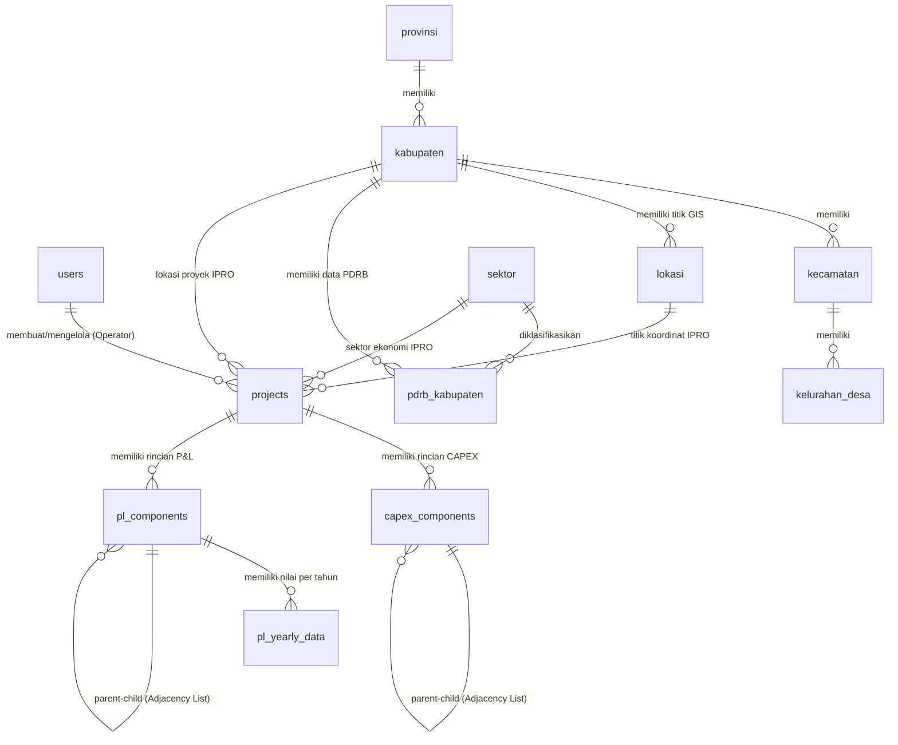

# Spesifikasi & Struktur Database Terintegrasi (PostgreSQL)
## Dashboard Executive Investment DPMPTSP + IPRO Project Calculation Engine

**Versi Database:** 2.0 (PostgreSQL Native Integration)  
**Database Engine:** PostgreSQL 15+  
**Standar Presisi Uang:** `NUMERIC(20, 2)`  
**Standar Waktu:** `TIMESTAMPTZ` (`TIMESTAMP WITH TIME ZONE`)  

---

## 1. Arsitektur Relasi Antar Domain Database

Database hasil penggabungan terdiri dari **6 Domain Utama** yang saling terintegrasi:



---

## 2. Struktur Tabel Detail (PostgreSQL DDL Specification)

### DOMAIN 1: Autentikasi, Keamanan & Pengguna

#### 1. Tabel `users`
Menampung data seluruh pengguna (Admin, Operator, dan User Terdaftar) beserta status verifikasi.

```sql
CREATE TABLE users (
    id BIGSERIAL PRIMARY KEY,
    name VARCHAR(255) NOT NULL,
    email VARCHAR(255) NOT NULL UNIQUE,
    phone VARCHAR(30) NULL,
    email_verified_at TIMESTAMPTZ NULL,
    password VARCHAR(255) NULL,
    role VARCHAR(20) NOT NULL DEFAULT 'user', -- 'admin', 'operator', 'user'
    status VARCHAR(20) NOT NULL DEFAULT 'approved', -- 'pending', 'approved', 'rejected'
    two_factor_enabled BOOLEAN NOT NULL DEFAULT FALSE,
    google_id VARCHAR(255) NULL UNIQUE,
    avatar TEXT NULL,
    remember_token VARCHAR(100) NULL,
    created_at TIMESTAMPTZ NOT NULL DEFAULT CURRENT_TIMESTAMP,
    updated_at TIMESTAMPTZ NOT NULL DEFAULT CURRENT_TIMESTAMP
);

CREATE INDEX idx_users_role ON users(role);
CREATE INDEX idx_users_status ON users(status);
```

#### 2. Tabel `activity_logs`
Pencatatan rekam jejak audit (*audit trail*) aktivitas admin dan operator.

```sql
CREATE TABLE activity_logs (
    id BIGSERIAL PRIMARY KEY,
    user_id BIGINT NULL REFERENCES users(id) ON DELETE SET NULL,
    action VARCHAR(255) NOT NULL,
    description TEXT NULL,
    ip_address VARCHAR(45) NULL,
    user_agent TEXT NULL,
    created_at TIMESTAMPTZ NOT NULL DEFAULT CURRENT_TIMESTAMP
);
```

#### 3. Tabel `import_histories`
Pencatatan riwayat impor data PDRB/Analisis dari file Excel.

```sql
CREATE TABLE import_histories (
    id BIGSERIAL PRIMARY KEY,
    user_id BIGINT NOT NULL REFERENCES users(id) ON DELETE CASCADE,
    file_name VARCHAR(255) NOT NULL,
    type VARCHAR(50) NOT NULL, -- 'lq', 'ss', 'pdrb', etc.
    total_rows INT NOT NULL DEFAULT 0,
    created_at TIMESTAMPTZ NOT NULL DEFAULT CURRENT_TIMESTAMP
);
```

---

### DOMAIN 2: Master Data Wilayah & Geografis (GIS)

#### 4. Tabel `provinsi`
```sql
CREATE TABLE provinsi (
    provinsi_id BIGSERIAL PRIMARY KEY,
    nama_provinsi VARCHAR(255) NOT NULL,
    created_at TIMESTAMPTZ NOT NULL DEFAULT CURRENT_TIMESTAMP,
    updated_at TIMESTAMPTZ NOT NULL DEFAULT CURRENT_TIMESTAMP
);
```

#### 5. Tabel `kabupaten`
```sql
CREATE TABLE kabupaten (
    kab_id BIGSERIAL PRIMARY KEY,
    provinsi_id BIGINT NOT NULL REFERENCES provinsi(provinsi_id) ON DELETE CASCADE ON UPDATE CASCADE,
    nama_kabupaten VARCHAR(255) NOT NULL,
    created_at TIMESTAMPTZ NOT NULL DEFAULT CURRENT_TIMESTAMP,
    updated_at TIMESTAMPTZ NOT NULL DEFAULT CURRENT_TIMESTAMP
);

CREATE INDEX idx_kabupaten_provinsi ON kabupaten(provinsi_id);
```

#### 6. Tabel `kecamatan`
```sql
CREATE TABLE kecamatan (
    id BIGSERIAL PRIMARY KEY,
    kabupaten_id BIGINT NOT NULL REFERENCES kabupaten(kab_id) ON DELETE CASCADE,
    nama_kecamatan VARCHAR(255) NOT NULL,
    created_at TIMESTAMPTZ NOT NULL DEFAULT CURRENT_TIMESTAMP,
    updated_at TIMESTAMPTZ NOT NULL DEFAULT CURRENT_TIMESTAMP
);
```

#### 7. Tabel `kelurahan_desa`
```sql
CREATE TABLE kelurahan_desa (
    id BIGSERIAL PRIMARY KEY,
    kecamatan_id BIGINT NOT NULL REFERENCES kecamatan(id) ON DELETE CASCADE,
    nama_desa VARCHAR(255) NOT NULL,
    created_at TIMESTAMPTZ NOT NULL DEFAULT CURRENT_TIMESTAMP,
    updated_at TIMESTAMPTZ NOT NULL DEFAULT CURRENT_TIMESTAMP
);
```

#### 8. Tabel `lokasi` (GIS Coordinates)
Menyimpan titik sampel/koordinat geografis potensi investasi untuk visualisasi Leaflet.js.

```sql
CREATE TABLE lokasi (
    id BIGSERIAL PRIMARY KEY,
    kabupaten_id BIGINT NULL REFERENCES kabupaten(kab_id) ON DELETE SET NULL,
    nama VARCHAR(255) NOT NULL,
    latitude NUMERIC(10, 8) NOT NULL,
    longitude NUMERIC(11, 8) NOT NULL,
    created_at TIMESTAMPTZ NOT NULL DEFAULT CURRENT_TIMESTAMP,
    updated_at TIMESTAMPTZ NOT NULL DEFAULT CURRENT_TIMESTAMP
);
```

---

### DOMAIN 3: Klasifikasi Standar (Sektor, KBLI, KBKI, HS Code)

#### 9. Tabel `sektor`
```sql
CREATE TABLE sektor (
    sektor_id BIGSERIAL PRIMARY KEY,
    nama_sektor VARCHAR(255) NOT NULL
);
```

#### 10. Tabel `data_kbli`
Klasifikasi Baku Lapangan Usaha Indonesia (KBLI 5 Digit) dengan self-referencing `kode_induk`.

```sql
CREATE TABLE data_kbli (
    id BIGSERIAL PRIMARY KEY,
    struktur VARCHAR(20) NOT NULL,
    level SMALLINT NOT NULL,
    kode VARCHAR(10) NOT NULL UNIQUE,
    kode_induk VARCHAR(10) NULL,
    kategori_kode VARCHAR(2) NULL,
    judul TEXT NOT NULL,
    cakupan TEXT NULL,
    tidak_cakupan TEXT NULL,
    created_at TIMESTAMPTZ NOT NULL DEFAULT CURRENT_TIMESTAMP,
    updated_at TIMESTAMPTZ NOT NULL DEFAULT CURRENT_TIMESTAMP
);

CREATE INDEX idx_kbli_kode_induk ON data_kbli(kode_induk);
```

#### 11. Tabel `data_kbki`
Klasifikasi Baku Komoditas Indonesia.

```sql
CREATE TABLE data_kbki (
    id BIGSERIAL PRIMARY KEY,
    kode VARCHAR(20) NOT NULL UNIQUE,
    kode_induk VARCHAR(20) NULL,
    level SMALLINT NOT NULL,
    nama TEXT NOT NULL,
    deskripsi TEXT NULL,
    created_at TIMESTAMPTZ NOT NULL DEFAULT CURRENT_TIMESTAMP,
    updated_at TIMESTAMPTZ NOT NULL DEFAULT CURRENT_TIMESTAMP
);
```

#### 12. Tabel `data_hs_code`
Harmonized System Code (HS Code) untuk ekspor-impor komoditas perdagangan.

```sql
CREATE TABLE data_hs_code (
    id BIGSERIAL PRIMARY KEY,
    kode_kategori VARCHAR(20) NULL,
    kode_kelompok VARCHAR(20) NULL,
    uraian_kelompok TEXT NULL,
    kode_subkelompok VARCHAR(20) NULL,
    uraian_subkelompok TEXT NULL,
    hs_code VARCHAR(50) NOT NULL,
    uraian_barang TEXT NULL,
    code VARCHAR(50) NULL,
    description TEXT NULL,
    category VARCHAR(255) NULL,
    created_at TIMESTAMPTZ NOT NULL DEFAULT CURRENT_TIMESTAMP,
    updated_at TIMESTAMPTZ NOT NULL DEFAULT CURRENT_TIMESTAMP
);

CREATE INDEX idx_hs_code ON data_hs_code(hs_code);
CREATE INDEX idx_hs_kategori ON data_hs_code(kode_kategori);
CREATE INDEX idx_hs_kelompok ON data_hs_code(kode_kelompok);
```


---

### DOMAIN 4: Data Ekonomi Makro & PDRB

#### 13. Tabel `pdrb_sumut` (Daerah Pembanding Acuan)
```sql
CREATE TABLE pdrb_sumut (
    id BIGSERIAL PRIMARY KEY,
    sektor_id BIGINT NOT NULL REFERENCES sektor(sektor_id) ON DELETE CASCADE,
    tahun INT NOT NULL,
    nilai_pdrb NUMERIC(20, 2) NOT NULL DEFAULT 0,
    created_at TIMESTAMPTZ NOT NULL DEFAULT CURRENT_TIMESTAMP,
    updated_at TIMESTAMPTZ NOT NULL DEFAULT CURRENT_TIMESTAMP
);
```

#### 14. Tabel `pdrb_kabupaten` (Daerah Analisis)
```sql
CREATE TABLE pdrb_kabupaten (
    id BIGSERIAL PRIMARY KEY,
    kabupaten_id BIGINT NOT NULL REFERENCES kabupaten(kab_id) ON DELETE CASCADE,
    sektor_id BIGINT NOT NULL REFERENCES sektor(sektor_id) ON DELETE CASCADE,
    tahun INT NOT NULL,
    nilai_pdrb NUMERIC(20, 2) NOT NULL DEFAULT 0,
    created_at TIMESTAMPTZ NOT NULL DEFAULT CURRENT_TIMESTAMP,
    updated_at TIMESTAMPTZ NOT NULL DEFAULT CURRENT_TIMESTAMP
);
```

---

### DOMAIN 5: Output Analisis Makroekonomi (Dual-Layer Architecture)

Sistem menggunakan **Dual-Layer Architecture** untuk memisahkan konteks data publik (Guest) dan riwayat kalkulasi per pengguna (Operator):

---

#### LAYER A: Master Baseline Data Publik (Read-Only / Guest Peta Investasi)

##### 15. Tabel `hasil_lq`
Data acuan resmi hasil perhitungan Location Quotient per Kabupaten/Kota.
```sql
CREATE TABLE hasil_lq (
    hasil_lq_id BIGSERIAL PRIMARY KEY,
    kab_id BIGINT NOT NULL REFERENCES kabupaten(kab_id) ON DELETE CASCADE ON UPDATE CASCADE,
    sektor_id BIGINT NOT NULL REFERENCES sektor(sektor_id) ON DELETE CASCADE ON UPDATE CASCADE,
    tahun INT NOT NULL,
    nilai_lq NUMERIC(10, 5) NOT NULL,
    kategori VARCHAR(50) NOT NULL,
    created_at TIMESTAMPTZ NOT NULL DEFAULT CURRENT_TIMESTAMP,
    updated_at TIMESTAMPTZ NOT NULL DEFAULT CURRENT_TIMESTAMP,
    CONSTRAINT unq_hasil_lq UNIQUE(kab_id, sektor_id, tahun)
);
```

##### 16. Tabel `hasil_ssa`
Data acuan resmi Shift-Share Analysis (komponen $r_n, r_{in}, r_{ij}, m_{ij}, c_{ij}$).
```sql
CREATE TABLE hasil_ssa (
    hasil_ssa_id BIGSERIAL PRIMARY KEY,
    kab_id BIGINT NOT NULL REFERENCES kabupaten(kab_id) ON DELETE CASCADE ON UPDATE CASCADE,
    sektor_id BIGINT NOT NULL REFERENCES sektor(sektor_id) ON DELETE CASCADE ON UPDATE CASCADE,
    tahun INT NOT NULL,
    rn NUMERIC(20, 5) NOT NULL DEFAULT 0,
    rin NUMERIC(20, 5) NOT NULL DEFAULT 0,
    rij NUMERIC(20, 5) NOT NULL DEFAULT 0,
    mij NUMERIC(20, 5) NOT NULL DEFAULT 0,
    cij NUMERIC(20, 5) NOT NULL DEFAULT 0,
    nij NUMERIC(20, 5) NULL,
    dij NUMERIC(20, 5) NULL,
    komponen_n NUMERIC(20, 5) NOT NULL DEFAULT 0,
    komponen_p NUMERIC(20, 5) NOT NULL DEFAULT 0,
    komponen_d NUMERIC(20, 5) NOT NULL DEFAULT 0,
    total_shift NUMERIC(20, 5) NOT NULL DEFAULT 0,
    kategori_pertumbuhan VARCHAR(100) NULL,
    kategori_daya_saing VARCHAR(100) NULL,
    periode TEXT NULL,
    created_at TIMESTAMPTZ NOT NULL DEFAULT CURRENT_TIMESTAMP,
    updated_at TIMESTAMPTZ NOT NULL DEFAULT CURRENT_TIMESTAMP,
    CONSTRAINT unq_hasil_ssa UNIQUE(kab_id, sektor_id, tahun)
);
```

##### 17. Tabel `hasil_tipologi_sektor` (Tabel Turunan LQ & SSA)
Matriks tipologi sektor yang **menghubungkan Foreign Key turunan** `hasil_lq_id` dan `hasil_ssa_id`.
```sql
CREATE TABLE hasil_tipologi_sektor (
    id BIGSERIAL PRIMARY KEY,
    hasil_lq_id BIGINT NULL REFERENCES hasil_lq(hasil_lq_id) ON DELETE SET NULL ON UPDATE CASCADE,
    hasil_ssa_id BIGINT NULL REFERENCES hasil_ssa(hasil_ssa_id) ON DELETE SET NULL ON UPDATE CASCADE,
    kab_id BIGINT NOT NULL REFERENCES kabupaten(kab_id) ON DELETE CASCADE ON UPDATE CASCADE,
    sektor_id BIGINT NOT NULL REFERENCES sektor(sektor_id) ON DELETE CASCADE ON UPDATE CASCADE,
    tahun INT NOT NULL,
    lq NUMERIC(10, 5) NULL,
    cij NUMERIC(20, 5) NULL,
    kuadran VARCHAR(30) NOT NULL,
    kategori_sektor VARCHAR(100) NULL,
    created_at TIMESTAMPTZ NOT NULL DEFAULT CURRENT_TIMESTAMP,
    updated_at TIMESTAMPTZ NOT NULL DEFAULT CURRENT_TIMESTAMP,
    CONSTRAINT unq_hasil_tipologi_sektor UNIQUE(kab_id, sektor_id, tahun)
);
```

##### 18. Tabel `hasil_tipologi_klassen` (Tabel Turunan Indikator)
Pengelompokan Klassen daerah yang **menghubungkan Foreign Key turunan** `indikator_provinsi_id` dan `indikator_kabupaten_id`.
```sql
CREATE TABLE hasil_tipologi_klassen (
    id BIGSERIAL PRIMARY KEY,
    indikator_provinsi_id BIGINT NULL REFERENCES indikator_provinsi(id) ON DELETE SET NULL ON UPDATE CASCADE,
    indikator_kabupaten_id BIGINT NULL REFERENCES indikator_kabupaten(id) ON DELETE SET NULL ON UPDATE CASCADE,
    kab_id BIGINT NOT NULL REFERENCES kabupaten(kab_id) ON DELETE CASCADE ON UPDATE CASCADE,
    sektor_id BIGINT NOT NULL REFERENCES sektor(sektor_id) ON DELETE CASCADE ON UPDATE CASCADE,
    tahun INT NOT NULL,
    laju_pertumbuhan NUMERIC(10, 5) NULL,
    kontribusi_pdrb NUMERIC(10, 5) NULL,
    pertumbuhan_kabupaten NUMERIC(10, 5) NULL,
    pertumbuhan_provinsi NUMERIC(10, 5) NULL,
    kontribusi_kabupaten NUMERIC(10, 5) NULL,
    kontribusi_provinsi NUMERIC(10, 5) NULL,
    kuadran VARCHAR(30) NOT NULL,
    created_at TIMESTAMPTZ NOT NULL DEFAULT CURRENT_TIMESTAMP,
    updated_at TIMESTAMPTZ NOT NULL DEFAULT CURRENT_TIMESTAMP,
    CONSTRAINT unq_hasil_tipologi_klassen UNIQUE(kab_id, sektor_id, tahun)
);
```

---

#### LAYER B: Interactive Operator Sandbox (Per-User Calculation Storage)

##### 19. Tabel `analisis_lq`
Menampung riwayat kalkulasi LQ khusus yang dieksekusi oleh **Operator (`user_id`)**.
```sql
CREATE TABLE analisis_lq (
    id BIGSERIAL PRIMARY KEY,
    user_id BIGINT NULL REFERENCES users(id) ON DELETE CASCADE ON UPDATE CASCADE,
    provinsi_id BIGINT NULL REFERENCES provinsi(provinsi_id) ON DELETE SET NULL ON UPDATE CASCADE,
    kabupaten_id BIGINT NULL REFERENCES kabupaten(kab_id) ON DELETE SET NULL ON UPDATE CASCADE,
    sektor_id BIGINT NOT NULL REFERENCES sektor(sektor_id) ON DELETE CASCADE ON UPDATE CASCADE,
    tingkat_wilayah VARCHAR(50) NULL,
    daerah_analisis VARCHAR(255) NULL,
    daerah_pembanding VARCHAR(255) NULL,
    tahun INT NOT NULL,
    pdrb_sektor_analisis NUMERIC(25, 2) NOT NULL DEFAULT 0,
    total_pdrb_analisis NUMERIC(25, 2) NOT NULL DEFAULT 0,
    pdrb_sektor_pembanding NUMERIC(25, 2) NOT NULL DEFAULT 0,
    total_pdrb_pembanding NUMERIC(25, 2) NOT NULL DEFAULT 0,
    nilai_lq NUMERIC(15, 6) NOT NULL DEFAULT 0,
    kategori VARCHAR(50) NOT NULL,
    keterangan TEXT NULL,
    created_at TIMESTAMPTZ NOT NULL DEFAULT CURRENT_TIMESTAMP,
    updated_at TIMESTAMPTZ NOT NULL DEFAULT CURRENT_TIMESTAMP
);

CREATE INDEX idx_analisis_lq_user ON analisis_lq(user_id);
```

##### 20. Tabel `analisis_ss`
Menampung riwayat kalkulasi Shift-Share khusus yang dieksekusi oleh Operator.
```sql
CREATE TABLE analisis_ss (
    id BIGSERIAL PRIMARY KEY,
    user_id BIGINT NULL REFERENCES users(id) ON DELETE CASCADE ON UPDATE CASCADE,
    provinsi_id BIGINT NULL REFERENCES provinsi(provinsi_id) ON DELETE SET NULL ON UPDATE CASCADE,
    kabupaten_id BIGINT NULL REFERENCES kabupaten(kab_id) ON DELETE SET NULL ON UPDATE CASCADE,
    sektor_id BIGINT NOT NULL REFERENCES sektor(sektor_id) ON DELETE CASCADE ON UPDATE CASCADE,
    tingkat_wilayah VARCHAR(50) NULL,
    daerah_analisis VARCHAR(255) NULL,
    daerah_pembanding VARCHAR(255) NULL,
    tahun_awal INT NOT NULL,
    tahun_akhir INT NOT NULL,
    rij NUMERIC(15, 6) NOT NULL DEFAULT 0,
    rin NUMERIC(15, 6) NOT NULL DEFAULT 0,
    rn NUMERIC(15, 6) NOT NULL DEFAULT 0,
    nij NUMERIC(30, 10) NOT NULL DEFAULT 0,
    mij NUMERIC(30, 10) NOT NULL DEFAULT 0,
    cij NUMERIC(30, 10) NOT NULL DEFAULT 0,
    dij NUMERIC(30, 10) NOT NULL DEFAULT 0,
    komponen_n NUMERIC(20, 2) NOT NULL DEFAULT 0,
    komponen_p NUMERIC(20, 2) NOT NULL DEFAULT 0,
    komponen_d NUMERIC(20, 2) NOT NULL DEFAULT 0,
    total_shift NUMERIC(20, 2) NOT NULL DEFAULT 0,
    status_pertumbuhan VARCHAR(100) NULL,
    status_daya_saing VARCHAR(100) NULL,
    created_at TIMESTAMPTZ NOT NULL DEFAULT CURRENT_TIMESTAMP,
    updated_at TIMESTAMPTZ NOT NULL DEFAULT CURRENT_TIMESTAMP
);

CREATE INDEX idx_analisis_ss_user ON analisis_ss(user_id);
```

##### 21. Tabel `analisis_tipologi`
Menampung riwayat matriks tipologi khusus hasil simulasi Operator.
```sql
CREATE TABLE analisis_tipologi (
    id BIGSERIAL PRIMARY KEY,
    user_id BIGINT NULL REFERENCES users(id) ON DELETE CASCADE ON UPDATE CASCADE,
    provinsi_id BIGINT NULL REFERENCES provinsi(provinsi_id) ON DELETE SET NULL ON UPDATE CASCADE,
    kabupaten_id BIGINT NULL REFERENCES kabupaten(kab_id) ON DELETE SET NULL ON UPDATE CASCADE,
    sektor_id BIGINT NOT NULL REFERENCES sektor(sektor_id) ON DELETE CASCADE ON UPDATE CASCADE,
    tingkat_wilayah VARCHAR(50) NULL,
    daerah_analisis VARCHAR(255) NULL,
    daerah_pembanding VARCHAR(255) NULL,
    tahun_awal INT NULL,
    tahun_akhir INT NULL,
    tahun INT NULL,
    nilai_ss NUMERIC(15, 6) NULL DEFAULT 0,
    nilai_lq NUMERIC(15, 6) NULL DEFAULT 0,
    kuadran VARCHAR(30) NULL,
    kategori_sektor VARCHAR(100) NULL,
    tipologi VARCHAR(100) NULL,
    created_at TIMESTAMPTZ NOT NULL DEFAULT CURRENT_TIMESTAMP,
    updated_at TIMESTAMPTZ NOT NULL DEFAULT CURRENT_TIMESTAMP
);

CREATE INDEX idx_analisis_tipologi_user ON analisis_tipologi(user_id);
```

##### 22. Tabel `analisis_klassen`
Menampung riwayat tipologi Klassen khusus hasil simulasi Operator.
```sql
CREATE TABLE analisis_klassen (
    id BIGSERIAL PRIMARY KEY,
    user_id BIGINT NULL REFERENCES users(id) ON DELETE CASCADE ON UPDATE CASCADE,
    provinsi_id BIGINT NULL REFERENCES provinsi(provinsi_id) ON DELETE SET NULL ON UPDATE CASCADE,
    kabupaten_id BIGINT NULL REFERENCES kabupaten(kab_id) ON DELETE SET NULL ON UPDATE CASCADE,
    sektor_id BIGINT NOT NULL REFERENCES sektor(sektor_id) ON DELETE CASCADE ON UPDATE CASCADE,
    tingkat_wilayah VARCHAR(50) NULL,
    daerah_analisis VARCHAR(255) NULL,
    daerah_pembanding VARCHAR(255) NULL,
    tahun_awal INT NULL,
    tahun_akhir INT NULL,
    tahun INT NULL,
    laju_pertumbuhan NUMERIC(15, 6) NULL DEFAULT 0,
    kontribusi_pdrb NUMERIC(15, 6) NULL DEFAULT 0,
    ri NUMERIC(15, 6) NULL DEFAULT 0,
    r NUMERIC(15, 6) NULL DEFAULT 0,
    yi NUMERIC(15, 6) NULL DEFAULT 0,
    y NUMERIC(15, 6) NULL DEFAULT 0,
    kuadran VARCHAR(30) NULL,
    klasifikasi VARCHAR(150) NULL,
    created_at TIMESTAMPTZ NOT NULL DEFAULT CURRENT_TIMESTAMP,
    updated_at TIMESTAMPTZ NOT NULL DEFAULT CURRENT_TIMESTAMP
);

CREATE INDEX idx_analisis_klassen_user ON analisis_klassen(user_id);
```

---


### DOMAIN 6: Mikrosistem Kalkulasi Finansial Proyek (IPRO Engine)

#### 19. Tabel `projects` (Header Dokumen IPRO)
Koreksi & Penggabungan: Ditambahkan Foreign Key ke `kabupaten_id`, `sektor_id`, dan `lokasi_id` untuk menghubungkan proyek IPRO dengan Peta GIS & Potensi Daerah DPMPTSP.

```sql
CREATE TABLE projects (
    id BIGSERIAL PRIMARY KEY,
    user_id BIGINT NOT NULL REFERENCES users(id) ON DELETE CASCADE,
    kabupaten_id BIGINT NULL REFERENCES kabupaten(kab_id) ON DELETE SET NULL,
    sektor_id BIGINT NULL REFERENCES sektor(sektor_id) ON DELETE SET NULL,
    lokasi_id BIGINT NULL REFERENCES lokasi(id) ON DELETE SET NULL,
    nama_proyek VARCHAR(255) NOT NULL,
    deskripsi TEXT NULL,
    tahun_awal INT NOT NULL DEFAULT 2026,
    jangka_waktu_tahun INT NOT NULL DEFAULT 10,
    status_publikasi VARCHAR(20) NOT NULL DEFAULT 'published', -- 'draft', 'published'
    
    -- Pengaturan Finansial P&L
    pl_persentase_pajak_penghasilan NUMERIC(5, 2) NOT NULL DEFAULT 0.00,
    pl_persentase_pajak_daerah NUMERIC(5, 2) NOT NULL DEFAULT 0.00,
    pl_persentase_bot_bgs_fee NUMERIC(5, 2) NOT NULL DEFAULT 0.00,
    pl_nominal_bunga NUMERIC(20, 2) NOT NULL DEFAULT 0.00,
    pl_nominal_depresiasi NUMERIC(20, 2) NOT NULL DEFAULT 0.00,
    
    -- Pengaturan Skema Pembiayaan Kredit & Cashflow
    rasio_modal_sendiri NUMERIC(5, 2) NOT NULL DEFAULT 60.00, -- Equity %
    rasio_pinjaman_kredit NUMERIC(5, 2) NOT NULL DEFAULT 40.00, -- Debt %
    suku_bunga_kredit NUMERIC(5, 2) NOT NULL DEFAULT 8.05, -- Bunga % p.a.
    tenor_kredit_tahun INT NOT NULL DEFAULT 5, -- Tenor Pinjaman
    
    created_at TIMESTAMPTZ NOT NULL DEFAULT CURRENT_TIMESTAMP,
    updated_at TIMESTAMPTZ NOT NULL DEFAULT CURRENT_TIMESTAMP
);

CREATE INDEX idx_projects_kabupaten ON projects(kabupaten_id);
CREATE INDEX idx_projects_sektor ON projects(sektor_id);
```

#### 20. Tabel `capex_components` (Struktur Hirarki CAPEX)
Menggunakan pendekatan *Adjacency List* (`parent_id`) untuk hierarki dinamis Kategori $\rightarrow$ Subkategori tanpa batasan level.

```sql
CREATE TABLE capex_components (
    id BIGSERIAL PRIMARY KEY,
    project_id BIGINT NOT NULL REFERENCES projects(id) ON DELETE CASCADE,
    parent_id BIGINT NULL REFERENCES capex_components(id) ON DELETE CASCADE,
    nama_komponen VARCHAR(255) NOT NULL,
    volume NUMERIC(15, 2) NULL,
    satuan VARCHAR(50) NULL, -- 'unit', 'm2', 'ls', 'set'
    luas NUMERIC(15, 2) NULL,
    harga_m2 NUMERIC(20, 2) NULL, -- Harga Satuan
    created_at TIMESTAMPTZ NOT NULL DEFAULT CURRENT_TIMESTAMP,
    updated_at TIMESTAMPTZ NOT NULL DEFAULT CURRENT_TIMESTAMP
);

CREATE INDEX idx_capex_project ON capex_components(project_id);
CREATE INDEX idx_capex_parent ON capex_components(parent_id);
```

#### 21. Tabel `pl_components` (Header Komponen P&L)
```sql
CREATE TABLE pl_components (
    id BIGSERIAL PRIMARY KEY,
    project_id BIGINT NOT NULL REFERENCES projects(id) ON DELETE CASCADE,
    tipe_kategori VARCHAR(30) NOT NULL, -- 'PENDAPATAN', 'BIAYA_OPERASIONAL'
    parent_id BIGINT NULL REFERENCES pl_components(id) ON DELETE CASCADE,
    nama_komponen VARCHAR(255) NOT NULL,
    created_at TIMESTAMPTZ NOT NULL DEFAULT CURRENT_TIMESTAMP,
    updated_at TIMESTAMPTZ NOT NULL DEFAULT CURRENT_TIMESTAMP
);

CREATE INDEX idx_pl_comp_project ON pl_components(project_id);
CREATE INDEX idx_pl_comp_parent ON pl_components(parent_id);
```

#### 22. Tabel `pl_yearly_data` (Nilai Proyeksi P&L Tahunan)
```sql
CREATE TABLE pl_yearly_data (
    id BIGSERIAL PRIMARY KEY,
    pl_component_id BIGINT NOT NULL REFERENCES pl_components(id) ON DELETE CASCADE,
    tahun_ke INT NOT NULL, -- 1, 2, 3, dst.
    nilai NUMERIC(20, 2) NOT NULL DEFAULT 0.00,
    created_at TIMESTAMPTZ NOT NULL DEFAULT CURRENT_TIMESTAMP,
    updated_at TIMESTAMPTZ NOT NULL DEFAULT CURRENT_TIMESTAMP,
    
    CONSTRAINT unq_pl_yearly UNIQUE(pl_component_id, tahun_ke)
);
```

> [!NOTE]
> **Arus Kas (Cash Flow)** dikalkulasi secara **100% dinamis (real-time)** dari penggabungan `capex_components`, parameter kredit `projects` (Equity/Debt 60:40, Suku Bunga 8.05%, Tenor), dan `pl_yearly_data` sehingga tidak memerlukan penyimpanan tabel fisik tambahan.
