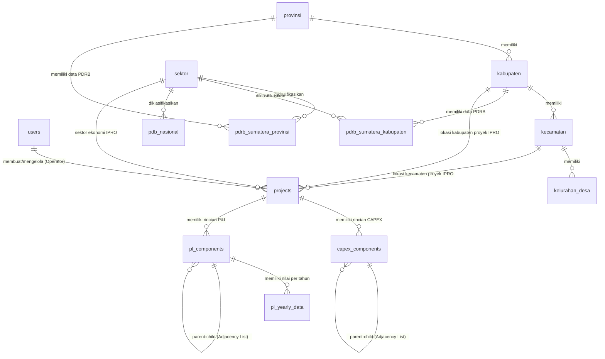

# Spesifikasi & Struktur Database Terintegrasi (PostgreSQL)
## Dashboard Executive Investment DPMPTSP + IPRO Project Calculation Engine

**Versi Database:** 2.1 (PostgreSQL Native Integration - Clean DDL Base)  
**Database Engine:** PostgreSQL 15+  
**Standar Presisi Uang:** `NUMERIC(20, 2)`  
**Standar Waktu:** `TIMESTAMPTZ` (`TIMESTAMP WITH TIME ZONE`)  

---

## 1. Arsitektur Relasi Antar Domain Database

Database terdiri dari **5 Domain Utama** yang saling terintegrasi (tanpa tabel `lokasi` terpisah):



---

## 2. Struktur Tabel Detail (PostgreSQL DDL Specification)

### DOMAIN 1: Autentikasi, Keamanan & Pengguna

#### 1. Tabel `users`
Menampung data seluruh pengguna (Admin, Operator, dan User Terdaftar) beserta status verifikasi.

```sql
CREATE TABLE users (
    id BIGSERIAL PRIMARY KEY,
    name VARCHAR(255) NOT NULL,
    email VARCHAR(255) NOT NULL UNIQUE,
    phone VARCHAR(30) NULL,
    email_verified_at TIMESTAMPTZ NULL,
    password VARCHAR(255) NULL,
    role VARCHAR(20) NOT NULL DEFAULT 'operator', -- 'admin', 'operator', 'user'
    status VARCHAR(20) NOT NULL DEFAULT 'pending', -- 'pending', 'approved', 'rejected'
    two_factor_enabled BOOLEAN NOT NULL DEFAULT FALSE,
    google_id VARCHAR(255) NULL UNIQUE,
    avatar TEXT NULL,
    remember_token VARCHAR(100) NULL,
    created_at TIMESTAMPTZ NOT NULL DEFAULT CURRENT_TIMESTAMP,
    updated_at TIMESTAMPTZ NOT NULL DEFAULT CURRENT_TIMESTAMP
);

CREATE INDEX idx_users_role ON users(role);
CREATE INDEX idx_users_status ON users(status);
```

#### 2. Tabel `activity_logs`
Pencatatan rekam jejak audit (*audit trail*) aktivitas admin dan operator.

```sql
CREATE TABLE activity_logs (
    id BIGSERIAL PRIMARY KEY,
    user_id BIGINT NULL REFERENCES users(id) ON DELETE SET NULL,
    action VARCHAR(255) NOT NULL,
    module VARCHAR(255) NULL,
    description TEXT NULL,
    desc TEXT NULL,
    ip_address VARCHAR(45) NULL,
    user_agent TEXT NULL,
    created_at TIMESTAMPTZ NOT NULL DEFAULT CURRENT_TIMESTAMP,
    updated_at TIMESTAMPTZ NOT NULL DEFAULT CURRENT_TIMESTAMP
);
```

#### 3. Tabel `import_histories`
Pencatatan riwayat impor data PDRB/Analisis dari file Excel/CSV.

```sql
CREATE TABLE import_histories (
    id BIGSERIAL PRIMARY KEY,
    user_id BIGINT NOT NULL REFERENCES users(id) ON DELETE CASCADE,
    file_name VARCHAR(255) NOT NULL,
    type VARCHAR(50) NOT NULL, -- 'lq', 'ss', 'pdrb', etc.
    total_rows INT NOT NULL DEFAULT 0,
    created_at TIMESTAMPTZ NOT NULL DEFAULT CURRENT_TIMESTAMP,
    updated_at TIMESTAMPTZ NOT NULL DEFAULT CURRENT_TIMESTAMP
);
```

---

### DOMAIN 2: Master Data Wilayah & Geografis (GIS)

#### 4. Tabel `provinsi`
Menampung data provinsi (dilengkapi titik koordinat GIS pusat).
```sql
CREATE TABLE provinsi (
    provinsi_id BIGSERIAL PRIMARY KEY,
    nama_provinsi VARCHAR(255) NOT NULL,
    latitude NUMERIC(10, 8) NULL,
    longitude NUMERIC(11, 8) NULL,
    created_at TIMESTAMPTZ NOT NULL DEFAULT CURRENT_TIMESTAMP,
    updated_at TIMESTAMPTZ NOT NULL DEFAULT CURRENT_TIMESTAMP
);
```

#### 5. Tabel `kabupaten`
Menampung data kabupaten/kota (dilengkapi titik koordinat GIS pusat).
```sql
CREATE TABLE kabupaten (
    kab_id BIGSERIAL PRIMARY KEY,
    provinsi_id BIGINT NOT NULL REFERENCES provinsi(provinsi_id) ON DELETE CASCADE ON UPDATE CASCADE,
    nama_kabupaten VARCHAR(255) NOT NULL,
    latitude NUMERIC(10, 8) NULL,
    longitude NUMERIC(11, 8) NULL,
    created_at TIMESTAMPTZ NOT NULL DEFAULT CURRENT_TIMESTAMP,
    updated_at TIMESTAMPTZ NOT NULL DEFAULT CURRENT_TIMESTAMP
);

CREATE INDEX idx_kabupaten_provinsi ON kabupaten(provinsi_id);
```

#### 6. Tabel `kecamatan`
```sql
CREATE TABLE kecamatan (
    id BIGSERIAL PRIMARY KEY,
    kabupaten_id BIGINT NOT NULL REFERENCES kabupaten(kab_id) ON DELETE CASCADE,
    nama_kecamatan VARCHAR(255) NOT NULL,
    created_at TIMESTAMPTZ NOT NULL DEFAULT CURRENT_TIMESTAMP,
    updated_at TIMESTAMPTZ NOT NULL DEFAULT CURRENT_TIMESTAMP
);
```

#### 7. Tabel `kelurahan_desa`
```sql
CREATE TABLE kelurahan_desa (
    id BIGSERIAL PRIMARY KEY,
    kecamatan_id BIGINT NOT NULL REFERENCES kecamatan(id) ON DELETE CASCADE,
    nama_desa VARCHAR(255) NOT NULL,
    created_at TIMESTAMPTZ NOT NULL DEFAULT CURRENT_TIMESTAMP,
    updated_at TIMESTAMPTZ NOT NULL DEFAULT CURRENT_TIMESTAMP
);
```

---

### DOMAIN 3: Klasifikasi Standar (Sektor, KBLI, KBKI, HS Code)

#### 8. Tabel `sektor`
```sql
CREATE TABLE sektor (
    sektor_id BIGSERIAL PRIMARY KEY,
    nama_sektor VARCHAR(255) NOT NULL
);
```

#### 9. Tabel `data_kbli`
```sql
CREATE TABLE data_kbli (
    id BIGSERIAL PRIMARY KEY,
    struktur VARCHAR(20) NOT NULL,
    level SMALLINT NOT NULL,
    kode VARCHAR(10) NOT NULL UNIQUE,
    kode_induk VARCHAR(10) NULL,
    kategori_kode VARCHAR(2) NULL,
    judul TEXT NOT NULL,
    cakupan TEXT NULL,
    tidak_cakupan TEXT NULL,
    created_at TIMESTAMPTZ NOT NULL DEFAULT CURRENT_TIMESTAMP,
    updated_at TIMESTAMPTZ NOT NULL DEFAULT CURRENT_TIMESTAMP
);

CREATE INDEX idx_kbli_kode_induk ON data_kbli(kode_induk);
```

#### 10. Tabel `data_kbki`
```sql
CREATE TABLE data_kbki (
    id BIGSERIAL PRIMARY KEY,
    kode VARCHAR(20) NOT NULL UNIQUE,
    kode_induk VARCHAR(20) NULL,
    level SMALLINT NOT NULL,
    nama TEXT NOT NULL,
    deskripsi TEXT NULL,
    created_at TIMESTAMPTZ NOT NULL DEFAULT CURRENT_TIMESTAMP,
    updated_at TIMESTAMPTZ NOT NULL DEFAULT CURRENT_TIMESTAMP
);
```

#### 11. Tabel `data_hs_code`
```sql
CREATE TABLE data_hs_code (
    id BIGSERIAL PRIMARY KEY,
    kode_kategori VARCHAR(20) NULL,
    kode_kelompok VARCHAR(20) NULL,
    uraian_kelompok TEXT NULL,
    kode_subkelompok VARCHAR(20) NULL,
    uraian_subkelompok TEXT NULL,
    hs_code VARCHAR(50) NOT NULL,
    uraian_barang TEXT NULL,
    code VARCHAR(50) NULL,
    description TEXT NULL,
    category VARCHAR(255) NULL,
    created_at TIMESTAMPTZ NOT NULL DEFAULT CURRENT_TIMESTAMP,
    updated_at TIMESTAMPTZ NOT NULL DEFAULT CURRENT_TIMESTAMP
);

CREATE INDEX idx_hs_code ON data_hs_code(hs_code);
```

---

### DOMAIN 4: Data Ekonomi Makro (PDB Nasional & PDRB Sumatera)

#### 12. Tabel `pdb_nasional`
Data PDB Tingkat Nasional Indonesia (`PDB_INDO.csv`).
```sql
CREATE TABLE pdb_nasional (
    id BIGSERIAL PRIMARY KEY,
    kode_wilayah VARCHAR(10) NOT NULL DEFAULT '00',
    sektor_id BIGINT NOT NULL REFERENCES sektor(sektor_id) ON DELETE CASCADE,
    tahun INT NOT NULL,
    nilai NUMERIC(20, 2) NOT NULL DEFAULT 0,
    created_at TIMESTAMPTZ NOT NULL DEFAULT CURRENT_TIMESTAMP,
    updated_at TIMESTAMPTZ NOT NULL DEFAULT CURRENT_TIMESTAMP
);
```

#### 13. Tabel `pdrb_sumatera_provinsi`
Data PDRB Tingkat Provinsi se-Sumatera (`Sumatera_PDRB_Provinsi.csv`).
```sql
CREATE TABLE pdrb_sumatera_provinsi (
    id BIGSERIAL PRIMARY KEY,
    provinsi_id BIGINT NOT NULL REFERENCES provinsi(provinsi_id) ON DELETE CASCADE,
    sektor_id BIGINT NOT NULL REFERENCES sektor(sektor_id) ON DELETE CASCADE,
    tahun INT NOT NULL,
    nilai_pdrb NUMERIC(20, 2) NOT NULL DEFAULT 0,
    created_at TIMESTAMPTZ NOT NULL DEFAULT CURRENT_TIMESTAMP,
    updated_at TIMESTAMPTZ NOT NULL DEFAULT CURRENT_TIMESTAMP
);
```

#### 14. Tabel `pdrb_sumatera_kabupaten`
Data PDRB Tingkat Kabupaten se-Sumatera (`Sumatera_PDRB_Kabupaten.csv`).
```sql
CREATE TABLE pdrb_sumatera_kabupaten (
    id BIGSERIAL PRIMARY KEY,
    kabupaten_id BIGINT NOT NULL REFERENCES kabupaten(kab_id) ON DELETE CASCADE,
    sektor_id BIGINT NOT NULL REFERENCES sektor(sektor_id) ON DELETE CASCADE,
    tahun INT NOT NULL,
    nilai_pdrb NUMERIC(20, 2) NOT NULL DEFAULT 0,
    created_at TIMESTAMPTZ NOT NULL DEFAULT CURRENT_TIMESTAMP,
    updated_at TIMESTAMPTZ NOT NULL DEFAULT CURRENT_TIMESTAMP
);
```

---

### DOMAIN 5: Engine Proyek Investasi (IPRO Engine)

#### 15. Tabel `projects`
```sql
CREATE TABLE projects (
    id BIGSERIAL PRIMARY KEY,
    user_id BIGINT NOT NULL REFERENCES users(id) ON DELETE CASCADE,
    kabupaten_id BIGINT NULL REFERENCES kabupaten(kab_id) ON DELETE SET NULL,
    kecamatan_id BIGINT NULL REFERENCES kecamatan(id) ON DELETE SET NULL,
    sektor_id BIGINT NULL REFERENCES sektor(sektor_id) ON DELETE SET NULL,
    alamat_lokasi TEXT NULL,
    nama_proyek VARCHAR(255) NOT NULL,
    deskripsi TEXT NULL,
    tahun_awal INT NOT NULL,
    jangka_waktu_tahun INT NOT NULL,
    status_publikasi VARCHAR(20) NOT NULL DEFAULT 'published',
    pl_persentase_pajak_penghasilan NUMERIC(5, 2) NULL DEFAULT 0,
    pl_persentase_pajak_daerah NUMERIC(5, 2) NULL DEFAULT 0,
    pl_persentase_bot_bgs_fee NUMERIC(5, 2) NULL DEFAULT 0,
    pl_nominal_bunga NUMERIC(20, 2) NULL DEFAULT 0,
    pl_nominal_depresiasi NUMERIC(20, 2) NULL DEFAULT 0,
    rasio_modal_sendiri NUMERIC(5, 2) NOT NULL DEFAULT 60.00,
    rasio_pinjaman_kredit NUMERIC(5, 2) NOT NULL DEFAULT 40.00,
    suku_bunga_kredit NUMERIC(5, 2) NOT NULL DEFAULT 8.05,
    tenor_kredit_tahun INT NOT NULL DEFAULT 5,
    created_at TIMESTAMPTZ NOT NULL DEFAULT CURRENT_TIMESTAMP,
    updated_at TIMESTAMPTZ NOT NULL DEFAULT CURRENT_TIMESTAMP
);
```
